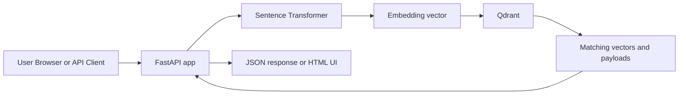

# Project Documentation

## 1. Overview

This project is a semantic search application that combines:

- FastAPI for the web server and API layer
- Qdrant for vector storage and similarity search
- Sentence Transformers for text embeddings
- A small browser UI for simple search and ingestion

The project is designed to let you search short documents by meaning rather than exact keyword match. A user types a query, the app converts that query into an embedding vector, and Qdrant returns the most similar stored documents.

## 2. High-Level Idea

Traditional search looks for matching words. Semantic search looks for matching meaning. This project does that by:

1. Converting text into dense vectors using `all-MiniLM-L6-v2`.
2. Saving those vectors in Qdrant.
3. Comparing a query vector to stored document vectors.
4. Returning the nearest matches with scores and payloads.

This makes the app useful for document lookup, question-like queries, knowledge snippets, and lightweight content discovery.

## 3. Architecture



The flow is straightforward:

- FastAPI receives a search query or ingest request.
- The embedder converts text to a vector.
- Qdrant stores or searches vectors.
- FastAPI returns results to the browser or API caller.

## 4. Repository Layout

```text
project/
├── app/
│   ├── db.py
│   ├── embedder.py
│   ├── ingest.py
│   ├── main.py
│   └── schemas.py
├── docs/
│   └── PROJECT_DOCUMENTATION.md
├── pyproject.toml
├── requirements.txt
├── run.py
├── README.md
└── .env
```

## 5. File-by-File Explanation

### 5.1 `app/db.py`

This file owns Qdrant configuration.

Responsibilities:

- Loads environment variables from `.env`
- Creates the Qdrant client
- Defines the collection name
- Defines embedding size and HNSW tuning settings
- Creates the collection at startup if it does not exist

Important values:

- `QDRANT_URL`: Local Qdrant or Qdrant Cloud endpoint
- `QDRANT_API_KEY`: Optional API key for cloud usage
- `QDRANT_COLLECTION`: Collection name, default `documents`
- `EMBEDDING_DIM`: Vector size, default `384`
- `QDRANT_HNSW_M`: HNSW graph degree
- `QDRANT_HNSW_EF_CONSTRUCT`: HNSW construction quality setting
- `QDRANT_SEARCH_EF`: Search-time recall setting

The app uses `create_collection()` on startup so the database structure is ready before any search happens.

### 5.2 `app/embedder.py`

This file loads the embedding model:

- `all-MiniLM-L6-v2`

It exposes:

- `get_embedding(text: str)` for one string
- `get_embeddings(texts: list[str])` for a batch of strings

The embeddings are normalized before being sent to Qdrant. Normalization is useful when using cosine distance because it makes similarity behavior more stable.

### 5.3 `app/schemas.py`

This file defines the data models used by FastAPI.

Models:

- `DocumentIn`: one document being ingested
- `IngestRequest`: wrapper for multiple documents
- `SearchRequest`: body-based search request
- `SearchHit`: one search result
- `SearchResponse`: list of hits returned by search

These schemas make the API clearer, validate user input, and generate better OpenAPI docs.

### 5.4 `app/ingest.py`

This file handles document insertion.

What it does:

- Defines default example documents
- Builds a payload for each document
- Generates embeddings for all incoming text values
- Converts documents into `PointStruct` objects
- Inserts them into Qdrant with `client.upsert(...)`

If no payload is provided to `/ingest`, the app seeds the default documents so you can test the system immediately.

### 5.5 `app/main.py`

This is the API entrypoint.

Routes:

- `GET /` returns a simple browser UI
- `GET /health` returns a JSON status response
- `POST /ingest` inserts documents
- `GET /search` searches by query string parameters
- `POST /search` searches by JSON body

This file also contains:

- Category filtering logic
- Qdrant query compatibility support for different client versions
- Result mapping into a clean response model

The home page is intentionally simple so a non-technical user can search without touching Swagger.

### 5.6 `run.py`

This is the local launch script.

It reads:

- `HOST`
- `PORT`

Then starts the FastAPI application with Uvicorn.

## 6. Data Flow

### 6.1 Startup Flow

When the app starts:

1. `.env` is loaded.
2. The Qdrant client is configured.
3. The collection is created if missing.
4. The FastAPI server starts.

### 6.2 Ingest Flow

When you call `/ingest`:

1. The app reads the documents from the request body or uses defaults.
2. Each document text is converted into an embedding vector.
3. A payload is built from text, category, and optional metadata.
4. Qdrant stores the vector and payload together.

### 6.3 Search Flow

When you call `/search`:

1. The query text is embedded.
2. The app optionally adds a category filter.
3. Qdrant compares the query vector with stored vectors.
4. The best matches are returned with scores and payloads.

## 7. UI Behavior

The home page at `/` is a lightweight search interface.

It includes:

- Query input
- Optional category field
- Result limit field
- Search button
- Seed Default Data button
- Open API Docs button

This interface is the easiest way to use the app if you do not want to interact with Swagger directly.

## 8. API Endpoints

### `GET /`

Returns a browser-based interface.

Use this if you want a simple search page.

### `GET /health`

Returns the service status.

Example response:

```json
{
  "status": "running",
  "collection": "documents"
}
```

### `POST /ingest`

Ingests documents into Qdrant.

If no body is sent, the app uses the default seed documents.

Example body:

```json
{
  "documents": [
    {
      "id": 101,
      "text": "Machine learning basics",
      "category": "AI",
      "metadata": {
        "source": "manual"
      }
    }
  ]
}
```

Example response:

```json
{
  "ingested": 1
}
```

### `GET /search`

Searches by query string.

Query parameters:

- `query`: search text
- `limit`: max number of results
- `category`: optional category filter

Example:

```text
/search?query=machine%20learning&limit=5&category=AI
```

### `POST /search`

Searches using a JSON request body.

Example body:

```json
{
  "query": "machine learning",
  "limit": 5,
  "category": "AI"
}
```

Example response:

```json
{
  "results": [
    {
      "id": 1,
      "text": "Machine learning basics",
      "category": "AI",
      "score": 0.91,
      "payload": {
        "text": "Machine learning basics",
        "category": "AI"
      }
    }
  ]
}
```

## 9. Configuration Reference

Create or edit `.env` in the project root.

```env
QDRANT_URL=http://localhost:6333
QDRANT_API_KEY=
QDRANT_COLLECTION=documents
EMBEDDING_DIM=384
QDRANT_HNSW_M=16
QDRANT_HNSW_EF_CONSTRUCT=100
QDRANT_SEARCH_EF=128
QDRANT_CHECK_COMPATIBILITY=false
HOST=127.0.0.1
PORT=8000
```

### Environment Variable Details

- `QDRANT_URL`: Qdrant base URL
- `QDRANT_API_KEY`: Cloud authentication key
- `QDRANT_COLLECTION`: Storage collection name
- `EMBEDDING_DIM`: Must match the vector size of the embedding model
- `QDRANT_HNSW_M`: Graph connectivity for HNSW indexing
- `QDRANT_HNSW_EF_CONSTRUCT`: Index build quality vs speed trade-off
- `QDRANT_SEARCH_EF`: Search quality vs latency trade-off
- `QDRANT_CHECK_COMPATIBILITY`: Enables or disables Qdrant client version checking
- `HOST`: Host used by Uvicorn
- `PORT`: Port used by Uvicorn

## 10. Qdrant Cloud vs Local Qdrant

### Local Qdrant

Use when you want a local development setup.

```env
QDRANT_URL=http://localhost:6333
QDRANT_API_KEY=
```

You must run a local Qdrant instance separately.

### Qdrant Cloud

Use when you want managed infrastructure.

```env
QDRANT_URL=https://your-cluster-url:6333
QDRANT_API_KEY=your-api-key
```

This is the easiest production-style setup because the app only needs a URL and API key.

## 11. Why HNSW Matters

HNSW is the approximate nearest-neighbor indexing structure used by Qdrant for fast similarity search.

Why it matters:

- Faster search at scale
- Good recall for semantic similarity
- Tunable quality and latency

Trade-offs:

- Higher values can improve search quality
- Higher values also increase memory and compute cost

The project exposes this tuning through environment variables so you can experiment without changing code.

## 12. Search and Filtering

The app supports category filtering.

Example use case:

- Search all documents
- Search only `AI` documents
- Search only `Health` documents

Filtering is useful when your collection mixes different topics and you want narrower results.

## 13. Version Compatibility Note

Different versions of `qdrant-client` expose different methods.

This project handles that by:

- Using `query_points()` when available
- Falling back to `search()` for older clients

This keeps the app usable across client versions and prevents a common runtime failure.

## 14. Troubleshooting

### The site says it cannot be reached

Check that Uvicorn is running and that you are opening the correct URL.

Use:

```text
http://127.0.0.1:8000/
```

or:

```text
http://localhost:8000/
```

### Search returns no results

Likely causes:

- You have not seeded any documents yet
- Your category filter is too narrow
- Your query does not match anything in the collection

Fix:

- Click `Seed Default Data` on the home page
- Search again

### Qdrant connection errors

Check:

- `QDRANT_URL`
- `QDRANT_API_KEY`
- Network access to the Qdrant host
- Whether the cloud URL includes the correct port when required

### `qdrant-client` API mismatch

This project already includes compatibility logic for the search call.

If you still see version-related issues, reinstall dependencies and restart the app.

### Slow first start

The first request can be slow because the sentence-transformer model needs to download and load.

That is normal.

## 15. Example Usage

### Using the browser UI

1. Start the server.
2. Open `/`.
3. Click `Seed Default Data`.
4. Search for terms like `machine learning`.

### Using the API

Search via curl:

```bash
curl -X POST http://127.0.0.1:8000/search \
  -H "Content-Type: application/json" \
  -d "{\"query\":\"machine learning\",\"limit\":5,\"category\":\"AI\"}"
```

Ingest via curl:

```bash
curl -X POST http://127.0.0.1:8000/ingest \
  -H "Content-Type: application/json" \
  -d "{\"documents\":[{\"id\":10,\"text\":\"Vector databases\",\"category\":\"AI\",\"metadata\":{\"source\":\"demo\"}}]}"
```

## 16. Design Choices

The project favors a simple structure over heavy abstraction.

Reasons:

- Easy to understand
- Easy to run locally
- Easy to modify for demos or prototypes
- Direct mapping from code to behavior

The trade-off is that everything is in a small set of files instead of a larger service layer architecture.

## 17. Future Improvements

If you want to extend the project, the next logical additions are:

- Authentication
- Rate limiting
- Background ingestion jobs
- Pagination for large result sets
- Uploading documents from files
- Externalizing the browser UI into separate templates or frontend code
- Collection stats and admin tools

## 18. Summary

This project is a compact but real semantic search system.

It demonstrates:

- Text embedding
- Vector storage
- Similarity search
- Optional filtering
- Cloud/local database support
- Basic browser UI

It is small enough to understand quickly, but it uses the same building blocks you would use in a production semantic search service.